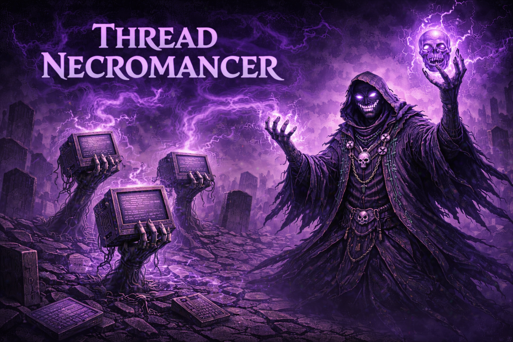

<p align="center">
  
</p>

<h1 align="center">thread-necromancer</h1>

<p align="center">
  <em>Raising insights from dead threads.</em>
</p>

<p align="center">
  <a href="LICENSE-MIT"></a>
  <a href="LICENSE-APACHE"></a>
  
  
</p>

<p align="center">
  JVM Thread Dump Analysis for Claude Code.<br>
  Part of the <a href="https://github.com/SegfaultSorcerer">SegfaultSorcerer</a> Java Tooling Ecosystem.
</p>

<p align="center">
  <strong>4 slash commands. 2 automation hooks. Zero config to get started.</strong>
</p>

---

<p align="center">
  <a href="#why">Why?</a> &bull;
  <a href="#skills">Skills</a> &bull;
  <a href="#hooks">Hooks</a> &bull;
  <a href="#installation">Installation</a> &bull;
  <a href="#how-it-works">How It Works</a> &bull;
  <a href="#what-it-detects">What It Detects</a> &bull;
  <a href="#synergies">Synergies</a> &bull;
  <a href="#contributing">Contributing</a>
</p>

---

## Why?

Thread dumps are one of the most powerful JVM diagnostic tools — and one of the most underused.

A production JVM app easily has 200+ threads. A raw thread dump is a wall of text: thousands of lines of stack traces, lock addresses, and JDK internals. Most developers can spot an obvious deadlock but miss the subtle patterns — connection pool exhaustion creeping in, a `synchronized` bottleneck serializing requests, a transaction holding a database connection hostage during an HTTP call to a slow external service.

**thread-necromancer** turns that wall of text into structured, actionable analysis. It captures thread dumps, parses them into meaningful sections, identifies known anti-patterns, and produces a prioritized report with concrete fix suggestions — complete with config properties and code examples.

Works with **any JVM application** — Spring Boot, Quarkus, Micronaut, Vert.x, Dropwizard, or plain Java. Framework-specific patterns (thread naming, proxy detection, scheduler defaults) are detected automatically.

No SaaS. No GUI. Just your terminal and Claude.

---

## Skills

| Command | Description |
|---|---|
| `/thread-dump [PID]` | Capture a live thread dump and analyze it |
| `/thread-analyze <file>` | Analyze an existing thread dump file |
| `/thread-watch [PID]` | Capture multiple dumps over time, analyze progression |
| `/thread-compare <f1> <f2>` | Diff two thread dumps, identify changes |

### `/thread-dump` — Live Capture + Analysis

Discovers running JVM processes, captures a thread dump via `jcmd` (or `jstack` as fallback), and produces a structured analysis report covering:

- **Thread state distribution** with health assessment
- **Deadlock detection** (JVM-reported + implicit lock chain analysis)
- **Blocked thread clusters** — groups of threads waiting at the same point
- **Thread pool health** — sizing, utilization, exhaustion
- **Lock contention hotspots** — which locks have the most waiters
- **Framework-specific findings** — Spring, Quarkus, Micronaut, Vert.x patterns detected automatically
- **Top 3 prioritized actions** with concrete config/code fixes

<details>
<summary>Example output</summary>

```
## Thread Dump Analysis Report

### Thread State Distribution
| State         | Count | Percentage | Assessment           |
|---------------|-------|------------|----------------------|
| RUNNABLE      | 23    | 9.3%       | Healthy              |
| WAITING       | 147   | 59.5%     | High — check below   |
| TIMED_WAITING | 45    | 18.2%     | Normal               |
| BLOCKED       | 32    | 13.0%     | Contention!          |

### Contention Hotspots
| Severity | Lock / Monitor             | Waiting | Holder  |
|----------|----------------------------|---------|---------|
| CRITICAL | HikariPool.getConnection   | 147     | exec-42 |
| CRITICAL | LegacyService.synchronized | 23      | exec-17 |

### Top 3 Actions
1. [CRITICAL] Increase HikariCP pool size — 147 threads blocked
   spring.datasource.hikari.maximum-pool-size: 20
2. [CRITICAL] Replace synchronized with ReentrantLock in LegacyService
3. [WARNING]  Increase @Scheduled pool size from default 1
   spring.task.scheduling.pool.size: 5
```

</details>

### `/thread-watch` — Temporal Analysis

Captures multiple dumps at configurable intervals and compares them to distinguish **truly stuck threads** from **momentary contention**:

- **Stuck threads** — same state + same stack across all dumps
- **Progressing threads** — changed state or moved in call stack
- **Thread count drift** — detecting thread leaks
- **Contention trends** — getting worse, resolving, or stable
- **Lock holder duration** — how long a thread has been holding a lock

### `/thread-compare` — Diff Two Dumps

Compares two thread dumps to show what changed:

- State transitions per thread (RUNNABLE → BLOCKED)
- New/disappeared threads (pool scaling, thread creation/death)
- Cluster size changes (contention improving or worsening)
- Lock holder changes

---

## Hooks

Both hooks are **opt-in** via flag files:

| Hook | Trigger | Flag File |
|---|---|---|
| Thread dump on test hang | Test command times out | `.thread-necromancer/dump-on-test-hang.enabled` |
| Startup thread baseline | Spring Boot app starts | `.thread-necromancer/startup-baseline.enabled` |

Enable a hook:
```bash
mkdir -p .thread-necromancer
touch .thread-necromancer/dump-on-test-hang.enabled
touch .thread-necromancer/startup-baseline.enabled
```

---

## Installation

### Claude Code Plugin Marketplace

```bash
claude plugin install SegfaultSorcerer/thread-necromancer
```

### Manual

```bash
git clone https://github.com/SegfaultSorcerer/thread-necromancer.git
# Add to your project's .claude/settings.json or install globally
```

---

## Prerequisites

Requires a JDK (not just JRE) for thread dump capture tools.

| Requirement | Minimum | Recommended |
|---|---|---|
| JDK | 11+ | 17+ |
| Claude Code | latest | latest |
| OS | any | any |

Check your setup:
```bash
./scripts/check-prerequisites.sh
```

**Platform support:**
- **macOS/Linux:** Bash scripts. `jcmd` should be on PATH (usually via `$JAVA_HOME/bin`).
- **Windows:** PowerShell scripts provided. Git Bash also works.
- **Docker:** Works if the JDK is in the container. For JRE-only containers, use `jstack` from the host.

---

## How It Works

```
  You                     Claude Code                  JVM
   |                         |                          |
   |  /thread-dump           |                          |
   |------------------------>|                          |
   |                         |  dump-collector.sh list  |
   |                         |------------------------->|
   |                         |  <PID list>              |
   |                         |<-------------------------|
   |  "Analyze PID 12345"    |                          |
   |------------------------>|                          |
   |                         |  dump-collector.sh       |
   |                         |  capture 12345           |
   |                         |------------------------->|
   |                         |  <raw thread dump>       |
   |                         |<-------------------------|
   |                         |                          |
   |                         |  dump-parser.sh          |
   |                         |  <structured sections>   |
   |                         |                          |
   |                         |  Claude analyzes with    |
   |                         |  reference material:     |
   |                         |  - thread-states.md      |
   |                         |  - common-patterns.md    |
   |                         |  - spring-patterns.md    |
   |                         |                          |
   |  Structured report      |                          |
   |  with Top 3 Actions     |                          |
   |<------------------------|                          |
```

---

## Configuration

thread-necromancer works with zero configuration. All output goes to `.thread-necromancer/dumps/` in your project root (auto-created, gitignored).

Optional settings via flag files in `.thread-necromancer/`:

| File | Effect |
|---|---|
| `dump-on-test-hang.enabled` | Auto-capture dump when tests hang |
| `startup-baseline.enabled` | Capture baseline dump after Spring Boot starts |

---

## What It Detects

| Pattern | Severity | What You'll See |
|---|---|---|
| Connection pool exhaustion | CRITICAL | Threads WAITING at `HikariPool.getConnection()` |
| Synchronized bottleneck | CRITICAL | Threads BLOCKED at `synchronized` method |
| Deadlock | CRITICAL | JVM-reported circular lock dependency |
| Thread pool exhaustion | CRITICAL | All pool threads busy, no idle capacity |
| External service timeout | WARNING | Threads RUNNABLE at `SocketInputStream.read()` |
| Scheduler pool = 1 | WARNING | Single scheduling thread, tasks queuing |
| Transaction + HTTP call | WARNING | DB connection held during external call |
| Event loop blocking | WARNING | Blocking I/O on Netty/Vert.x event loop |
| Thread leak | WARNING | Growing thread count across dumps |
| @Async pool exhaustion | WARNING | Tiny async pool, tasks rejected |
| Open-in-view lazy loading | INFO | Hibernate proxies in controller layer |

---

## Synergies

thread-necromancer works alongside other SegfaultSorcerer tools:

| Tool | Synergy |
|---|---|
| **spring-grimoire** | `/spring-jpa-audit` finds N+1 queries → `/thread-dump` shows the connection pool impact |
| **heap-seance** | Memory analysis shows what's allocated → thread analysis shows who's allocating |
| **gc-exorcist** (planned) | GC pauses cause thread freezes → temporal analysis detects "all threads paused" |

---

## Contributing

See [CONTRIBUTING.md](CONTRIBUTING.md).

---

## License

Dual-licensed under [MIT](LICENSE-MIT) and [Apache 2.0](LICENSE-APACHE), at your option.
